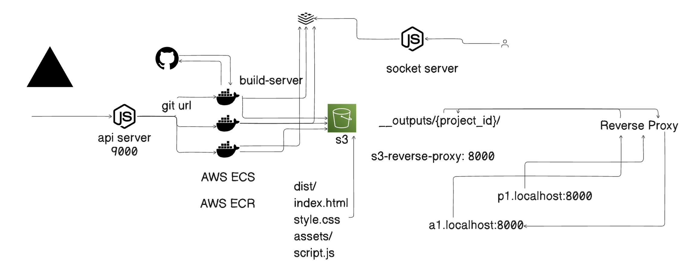

# DevDock

## Introduction
DevDock is a deployment automation platform that simplifies the process of hosting applications directly from GitHub repositories. Inspired by Netlify, DevDock automates the build and deployment process, ensuring efficient and scalable hosting. It leverages **Docker, AWS ECS, AWS S3, and a reverse proxy** for seamless and reliable project deployment.

## Table of Contents
- [Introduction](#introduction)
- [Features](#features)
- [Architecture](#architecture)
- [Installation](#installation)
- [Usage](#usage)
- [Contributing](#contributing)
- [License](#license)

## Features
- **Automated Deployment**: Fetches project source code from GitHub and deploys it automatically.
- **Dockerized Environment**: Runs projects inside containers for consistent and isolated execution.
- **AWS Integration**: Utilizes **AWS ECS, AWS S3, and AWS ECR** for efficient and scalable cloud deployment.
- **Reverse Proxy**: Ensures seamless routing of requests to appropriate containers.
- **Live Deployment Status**: Provides real-time build status updates using **Socket.io**.
- **Custom Domains & Static File Hosting**: Supports static files like HTML, CSS, JavaScript, and assets.

## Architecture
DevDock follows a **microservices-based architecture** with the following key components:
- **API Server** (Node.js, Express.js) → Handles user requests, GitHub integration, and job scheduling.
- **Build Server** (Dockerized) → Pulls code from GitHub, builds it inside a container, and prepares output.
- **AWS S3 Storage** → Stores project outputs (HTML, CSS, JS, assets) for deployment.
- **Reverse Proxy** (Nginx) → Routes incoming requests to appropriate deployments.
- **Socket Server** → Streams live build logs to users.

  

## Installation
### Prerequisites
- Install **Docker**: [Download Docker](https://www.docker.com/products/docker-desktop)
- Install **Node.js**: [Download Node.js](https://nodejs.org/)
- Install **AWS CLI**: [Download AWS CLI](https://aws.amazon.com/cli/)

### Clone the Repository
```bash
git clone https://github.com/sanketn2k04/DevDock.git
cd DevDock
```

### Build and Run the Containers
```bash
docker-compose up --build
```

## Usage
### Deploying a Project
1. Provide a GitHub repository URL via the API or UI.
2. The system will **fetch the source code**, **build the project**, and **deploy it**.
3. The deployed project will be accessible via a unique URL.

### Running Commands Inside a Container
To execute commands inside a running container:
```bash
docker exec -it <container_name> /bin/bash
```

### Stopping the Containers
```bash
docker-compose down
```

## Contributing
We welcome contributions! Follow these steps:
1. Fork the repository.
2. Create a new branch: `git checkout -b feature-branch`
3. Make your changes.
4. Commit the changes: `git commit -m "Add new feature"`
5. Push to your branch: `git push origin feature-branch`
6. Submit a pull request.

## License
This project is licensed under the **MIT License**.
